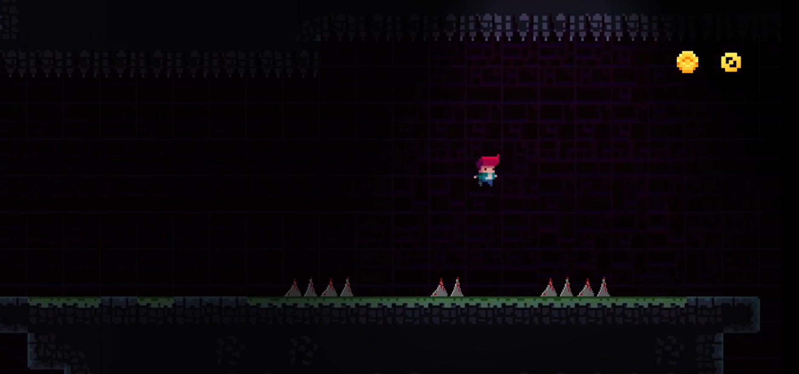
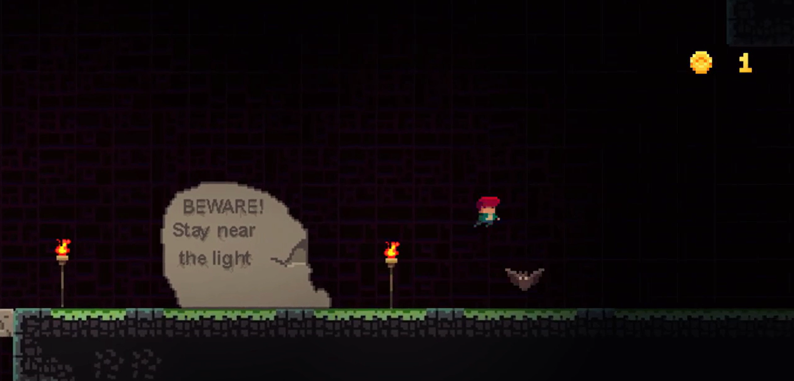
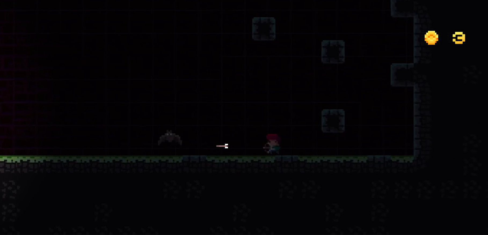
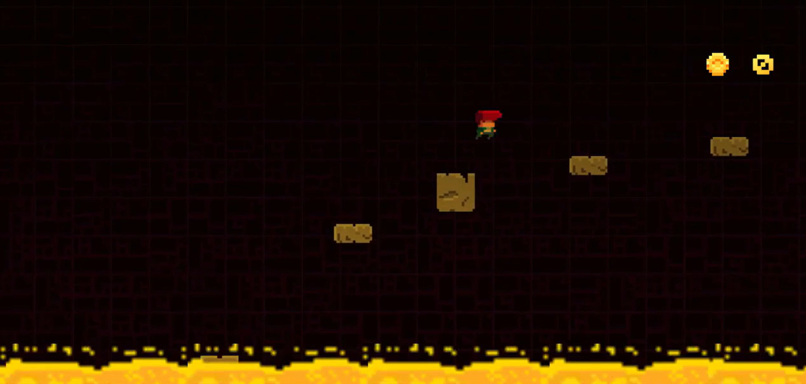
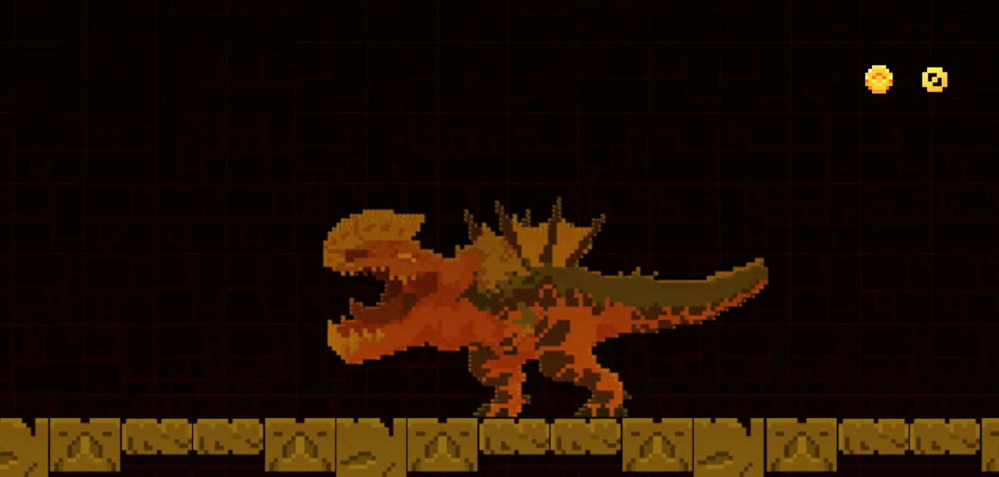

# A Sad Journey 🛤️🎮
A Sad Journey is a 2D pixel art platformer that serves as my first-ever game. Developed using Unity and C#, it offers an emotionally engaging experience as you guide a character through various levels filled with unique obstacles. Each level challenges players with accurate jumping mechanics, evading enemies (bats), navigating falling floors, and even facing a final boss. The game's central theme is about a person seeking what more life has to offer, culminating in an epic showdown to claim glory.

## 🛠️ About the Game
In A Sad Journey, you embark on a journey through multiple levels, each filled with different challenges that test your platforming skills. The game features obstacles like precise jumping, escaping from enemies, navigating falling floors, and even facing a tough boss fight. Each level is designed to feel distinct and unique, providing players with fresh experiences as they progress through the game.

## 🎯 Features
Challenging Platforming
Overcome various obstacles like accurate jumps, escaping enemies, and tricky platforming sequences.
Each level introduces new challenges to keep the gameplay engaging.
Boss Fight
Confront a challenging boss at the end of your journey, testing all your skills learned throughout the game.
Pixel Art Aesthetic
Beautiful pixel art created with Aseprite, featuring unique tiles, environments, and animations.
A Quest for Glory
Embark on a journey to discover what more life has to offer, facing trials and tribulations along the way.
## 🎮 Gameplay
Objective: Guide the main character through various levels, overcoming obstacles and defeating enemies, ultimately to face the boss and claim glory.
Challenge: The game features precise platforming, with falling floors, bats, and other enemies that require quick reflexes and strategic thinking.
## 🚀 What I Learned
Movement and Collision: Mastered player movement mechanics and handling collision in a platforming environment.
A Pathfinding:* Learned how to implement pathfinding for enemy AI, particularly for bats in the game.
Pixel Art Creation: Developed skills in pixel art using Aseprite, including creating tilesets and animations.
Game Design: Focused on creating diverse levels, each with a unique atmosphere and set of challenges.
Unity and C#: Gained hands-on experience with Unity and C#, building a 2D platformer from the ground up.
## 🔧 Built With
Engine: Unity
Language: C#
Development Time: X months (Add the duration of development)
## 📷 Screenshots

---

## 📂 How to Play
Clone the repository:
bash
Copy code
git clone https://github.com/Hessine-Lengliz/ASadJourney.git
Open the project in Unity (version XX.X.X or later).
Press the Play button to start the game.
Guide your character through levels and defeat the boss!
## 📢 Feedback
I hope you enjoy A Sad Journey! If you have any feedback, feel free to open an issue or reach out via:

Email: lengliz.hessine@gmail.com
GitHub Profile
## 🛠️ Languages and Tools

     

